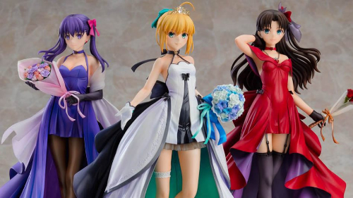

# SimpleTooltip

A lightweight, flexible JavaScript <u class='with-tooltip' title='a.k.a. infotip or hint'>tooltip</u> library

---

## Features

- Separation of styles and content --- Reusable `Style` object
- Minimal additional markup required --- Compatible with the `title` attribute
- Optional polygon activation area --- Just supply an array of coordinates
- Anchored to the target or following the cursor
- HTML support and nested tooltips
- Available out of the box, yet fully customizable via options and CSS
- Simple transition settings

## Examples

### Wiki: Button

- The `template` tag
- Tip size customization
- Transition settings

=== "Output"
	> <span id='button-def'>The term <u><b>button</b><template><button onclick="alert('I have a fat tip')" style="background-color: white; cursor: pointer">Click Me</button></template></u> refers to any graphical control element that provides the user a simple wayto trigger an event or to interact with dialog boxes. [<u><a href='https://en.wikipedia.org/wiki/Button_(computing)' target='_blank'>Wikipedia</a><template>The free encyclopedia</template></u>]</span>

=== "HTML"
	```html
	The term
		<u>
			<b>button</b>
			<template>
				<button onclick="alert('I have a fat tip')">Click Me</button>
			</template>
		</u>
	refers to any graphical control element that provides the user a simple way
	to trigger an event or to interact with dialog boxes.
	[
		<u>
			<a href='https://en.wikipedia.org/wiki/Button_(computing)' target='_blank'>
				Wikipedia
			</a>
			<template>
				The free encyclopedia
			</template>	
		</u>
	]
	```

=== "JavaScript"
	```javascript
	const style = new ST.Style({
		position: 'bottom',
		tipSize: '10px',
		transition: { delay: [0, 500], duration: [200, 500] }
	});
	style.generateFromChild(ST.Selector('u'));
	```

### Wiki: Tooltip

- The `title` attribute
- Nested tooltips
- User-defined CSS

=== "Output"
	> <span id='tooltip-def'>The <b>tooltip</b>, also known as <b>infotip</b> or <b>hint</b>, is a common <u>graphical user interface<template>A form of <u title="The space where interactions between humans and machines occur">user interface</u> that allows users to interact with electronic devices through graphical icons and audio indicator</template></u> element in which, when hovering over a screen element or component, a text box displays information about that element (such as a description of a button's function, or what an abbreviation stands for). [<u title='The free encyclopedia'><a href='https://en.wikipedia.org/wiki/Tooltip' target='_blank'>Wikipedia</a></u>]</span>

=== "HTML"
	```html
	The <b>tooltip</b>, also known as <b>infotip</b> or <b>hint</b>, is a common
		<u>
			graphical user interface
			<template>
				A form of <u title="The space where interactions between humans and machines occur">user interface</u>
				that allows users to interact with electronic devices through graphical icons and audio indicator
			</template>
		</u>
	element in which, when hovering over a screen element or component,
	a text box displays information about that element
	(such as a description of a button's function, or what an abbreviation stands for).
	[
		<u title='The free encyclopedia'>
			<a href='https://en.wikipedia.org/wiki/Tooltip' target='_blank'>
				Wikipedia
			</a>
		</u>
	]
	```

=== "CSS"
	```css
	.ST.blue {
		color: #fff;
		background-image: linear-gradient(#54b4eb, #2FA4E7, #1d9ce5);
		background-repeat: no-repeat;
	}
	```

=== "JavaScript"
	```javascript
	const style = new ST.Style({
		classList: ['blue'],
		tipColor: '#1d9ce5',
		useHTML: true,
		position: 'top',
		transition: { delay: [0, 500], duration: [200, 500] }
	});
	style.generateFromChild(ST.Selector('u'));
	style.generateFromTitle(ST.Selector('u'));
	```

### Moe Girls

- Polygon activation area
- Following the cursor
- Supply JS strings as content

Mouseover their face to learn their name!

=== "Output"
	
	<div id='fsn'></div>

=== "HTML"
	```html
	<div id='fsn'></div>
	```

=== "JavaScript"
	```javascript
	const style = new ST.Style({
		classList: ['blue'],
		tipColor: '#1d9ce5',
		relativeTo: 'cursor',
		transition: { delay: [0, 100] }
	});
	const pic = document.getElementById('fsn');
	const sakura = [[101, 18], [133, 24], [136, 52], [106, 74], [90, 64], [81, 38]];
	const saber = [[224, 16], [253, 10], [275, 30], [269, 60], [250, 72], [225, 56], [213, 32]];
	const rin = [[386, 10], [405, 18], [406, 47], [391, 64], [376, 63], [360, 45], [365, 18]];
	style.generateOne(pic, () => 'Sakura', sakura);
	style.generateOne(pic, () => 'Artoria (Saber)', saber);
	style.generateOne(pic, () => 'Rin', rin);
	```

## Playground

### Alignment

<form class='alignment'>
	<input type='range' min='50' max='200' value='100' id='height' name='height'>
	<br>
	<input type='submit'>
</form>
<div class='demo alignment'>
	<div title="I'm in the middle">height = 100px</div>
</div>

### Transition

<form class='transition'>
	<label for='delay-in'>Delay in activation</label>
	<input type='range' min='0' max='2000' value='0' id='delay-in' name='delay-in'>
	<br>
	<label for='delay-out'>Delay in deactivation</label>
	<input type='range' min='0' max='2000' value='500' id='delay-out' name='delay-out'>
	<br>
	<label for='duration-in'>Duration of activation</label>
	<input type='range' min='0' max='2000' value='500' id='duration-in' name='duration-in'>
	<br>
	<label for='duration-out'>Duration of deactivation</label>
	<input type='range' min='0' max='2000' value='500' id='duration-out' name='duration-out'>
	<br>
	<input type='submit'>
</form>
<div class='demo transition'>
	<div title="I am your tooltip"><code>delay = [0, 500], duration = [500, 500]</code></div>
</div>
